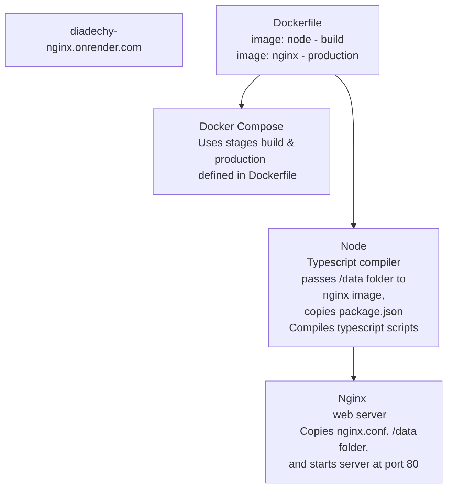

```mermaid
flowchart TD
site["diadechy-nginx.onrender.com"]
    dockerfile["Dockerfile
    image: node - build
    image: nginx - production"] --> compose["Docker Compose
    Uses stages build & production 
    defined in Dockerfile"]
    dockerfile ---> node["Node
Typescript compiler
passes /data folder to 
nginx image,
copies package.json
Compiles typescript scripts"]
    node --> nginx["Nginx 
    web server
    Copies nginx.conf, /data folder,
and starts server at port 80"]


```
